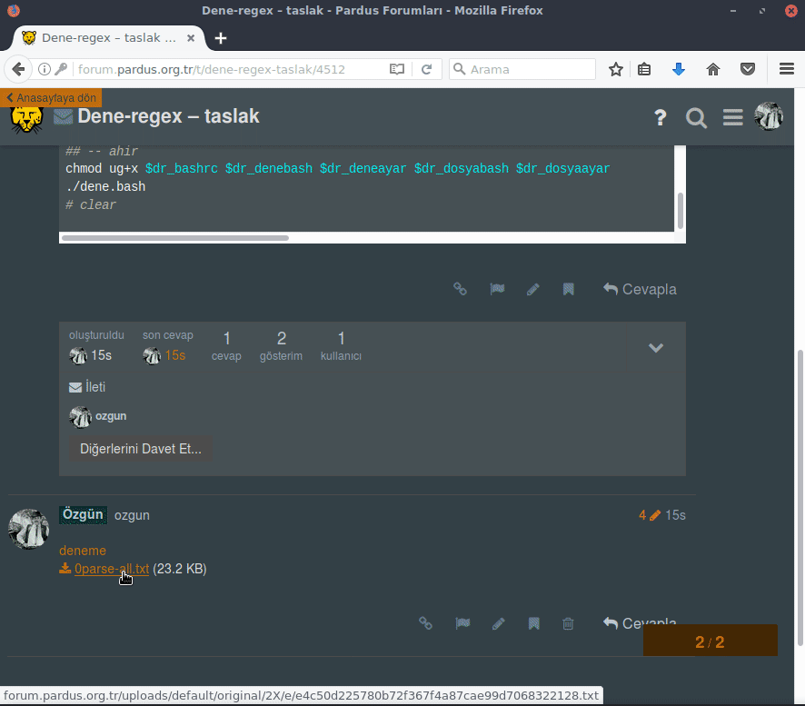

# Setup für eine eingeschränkte Shell-Umgebung

Eingeschränkte Shell-Umgebung zum lernen/testen von Regulären Ausdrücken.

## Haupteigenschaften und Ziele des Projektes

- Sandbox: Eingeschränkte Shell-Umgebung, um das Risiko (löschen von Dateien, ...) gering zu halten.
- Fokus: Einfache, unkomplizierte Installation/Einrichtung/Nutzung, um sich auf das Thema "Reguläre Ausdrücke" zu konzentrieren.
- Führung:
    - Zielführende Leitung zu den Schlüsselkonzepten durch Aufgabenstellungen, eigene Funktionen und Code-Beispielen.
    - Geordnete Einreihung dieser, um ein möglichst einfaches Verständnis, durch aufeinander aufbauende Teilkompetenzen, zu gewährleistet wird.

## Noch ein Paar Worte zum Projekt

Das eigentliche Ziel dieses Projektes, ging über den Setup einer eingeschränkten Shell-Umgebung hinaus. Eine Lern-/Testumgebung mit ergebnisorientierten Aufgaben, (Code-)Beispielen, Quellen, ... sollte entwickelt werden, um einen bestimmten Lernerfolg bei minimalem Risiko (löschen von Dateien, ...) zu erreichen.

## Notiz

Mir ist klar, dass das Skript viele Verbesserungen nötig hat (mehrfachverwendung von Variablen, unsinnige strukturierung von Code, …). Anfangs sollte es einfach einfaches "Mittel zum Zweck" sein, wuchs aber immer mehr und wurde von mir mit „dirty-snippets“ erweitert und nicht reorganisiert. Auch wollte ich selber beim erstellen lernen (z.B. Awk). So habe ich die Verwendung von z.B. Awk stur umgesetzt und dabei viel gelernt :)

## Aufbau und Nutzung

### Installation und Nutzung

### Anpassungen
